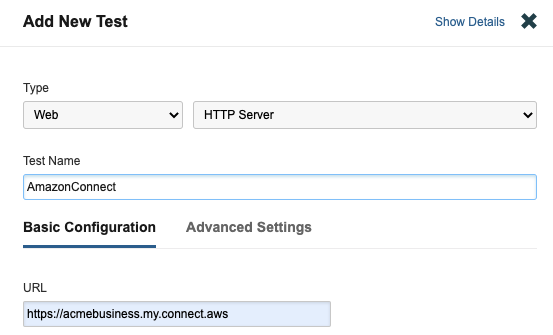
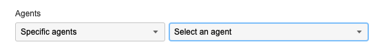
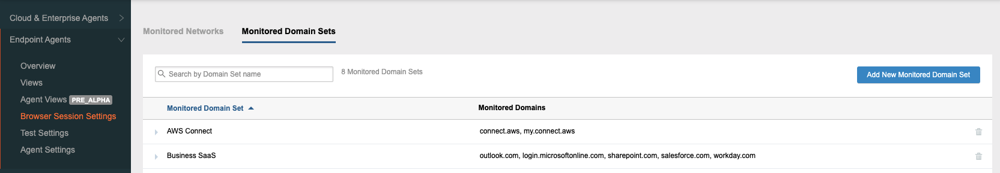
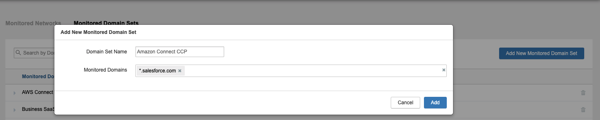
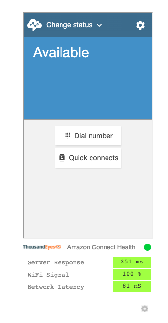
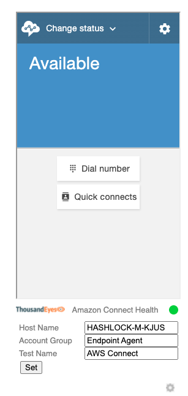

# ThousandEyes Amazon Connect Widget

This reference project illustrates how to integrate ThousandEyes metrics directly into an Amazon Connect streams endpoint, like the CCP softphone. Integrating ThousandEyes metrics allows you display the health of each of your end-user's connection to Amazon Connect based on ThousandEyes monitoring.

This reference project includes the following folders:

* **client** - example client side code that shows how to display a ThousandEyes health metrics widget alongside Amazon Connect Streams soft phone. Includes sample HTML and CSS code that can be modified by the end user to fit their Amazon Connect client side deployment.
  
* **service** - an AWS CloudFormation template that will deploy an API gateway service to allow the querying ThousandEyes API from the client frontend. This project includes a CloudFormationTemplate and Labmda-API Gateway service.

Follow the steps below to monitor Amazon Connect with ThousandEyes Endpoint Agent and deploy the sample ThousandEyes widget to view end-user heath.
# Setting Up ThousandEyes
The following steps assume you have a ThousandEyes account. If you do not, you can sign-up for a 14-day free trial at https://www.thousandeyes.com/signup/.

## Deploy and Configure ThousandEyes Endpoint Agents
First you'll want to setup your ThousandEyes monitoring by deploying ThosuandEyes Endpoint Agents. ThousandEyes Endpoint Agents monitor network and app performance across the internet as well as collect device health. With Endpoint Agents installed on your Amazon Connect users' devices, you'll be able to quickly identify any network or device issues that may be impacting a user's experience of Amazon Connect.

Follow the steps in this [Endpoint deployment guide](https://docs.thousandeyes.com/product-documentation/global-vantage-points/endpoint-agents/quick-guide-on-endpoint-agent#configuring-and-deploying-the-endpoint-agent) to install the ThousandEyes Endpoint agent on any Windows or MacOS based user device.

**Note** - for each deployed agent, note the Agent Name. You will use this when setting up the client widget below. The agent name is typically the device host name. For example: `hans-mac-us`

## Configure ThousandEyes to Monitor Amazon Connect
Once you've deployed at least one ThousandEyes Endpoint Agent you'll want to configure ThousandEyes to monitor Amazon Connect from those agents. 

### Create a Scheduled Test
First you'll need to create a "Scheduled Test".

1) Log in to your ThousandEyes account at https://app.thousandeyes.com
2) Select Endpoint Agent --> [Test Settings](https://app.thousandeyes.com/endpoint/test-settings/) 
3) Select "Add New Test" and create a new "Web - HTTP Server" test
4) In the **URL** field enter the URL of your Amazon Connect service. For example `https://acmebusiness.my.connect.aws`.  
5) Name the test `AmazonConnect` or something similar. You will use this name when setting up the client widget (see below)
   
  
1) In the **Agents** field select the Endpoint Agents you installed in the previous step. 
   
  
1) Select **Add New Test** in the lower right.
2) Also note the Account Group name that you created this test in, you will use it below.
### Enable ThousandEyes Session Monitorintg
Next you'll want to enable session monitoring when the user is using the Amazon Connect web client. 
1) Click on **Browser Session Settings** --> **Monitored Domain Sets** --> Add New Monitored Domain Set

2) Enter the web domain that your users browse to when using Amazon Connect. For example - if your users access Amazon Connect CCP via your Salesforce instance, you might add something like `*.salesforce.com`.  
  
3) Click **Add**
 
ThousandEyes will now start running network monitoring to your Amazon Connect instance from each of the Endpoint Agents you installed and specified. It will also collect device health metrics that can be used alongside the network monitoring to quickly troubleshoot any issues that impact Amazon Connect services when users are using the Amazon Connect CCP soft phone.
# Deploy the ThousandEyes Metrics Service
Next, you'll deploy the ThousandEyes metrics service to you AWS cloud environment. This service will expose an API that allows querying metrics data from ThousandEyes for your Amazon Connect users. That data can then be displayed using the ThousandEyes client widget on each end-user device alongside the Amazon Connect CCP.  
### Get your ThousandEyes API Token
First you'll need to get your ThousandEyes API token which will be used to query metrics from ThousandEyes.  
   1) Log in to ThousandEyes and click on Account Settings -> Users and Roles -> Profile.
   2) Your Basic Auth token is listed on the bottom of the page. If you do not have one yet, click "Regenerate"

### Deploy the CloudFormation template
Next, you'll need to deploy the service that will allow querying ThousandEyes metrics from your Amazon Connect streams client.
   1) Log in to your AWS account
   2) Click on the following CloudFormation template link to deploy the ThousandEyes metrics service in your AWS account. https://console.aws.amazon.com/cloudformation/home#/stacks/new?templateURL=https://te-amazon-connect.s3.amazonaws.com/aws-deploy.yaml
   3) Fill in the following:
      1) ThousandEyes Username (email)
      2) ThousandEyes API Token (see above)
   4) Click deploy
   5) Once deployed - copy the public API endpoint. Example: https://jur5bq3i8a.execute-api.us-east-1.amazonaws.com/v1
   
# Embed the ThousandEyes Client Widget
Lastly, you can use the included example client code in the `/client` folder to embed a ThousandEyes metrics widget on the same webpage that you embed the Amazon Connect CCP. 
1) The `/client` folder contains an example `index.html` file and javascript that shows how to embed the ThousandEyes widget alongside the Amazon Connect CCP. Open the `index.html` file.
2) Fill in the required variables:
   * `instanceURL` - the url of your Amazon Connect instance
   * `metricsURL` - the url of your ThousandEyes metrics API service you deployed in the above step
   * `defaultHostName` - the default hostname that identifies the end user machichine; this should be the same name as the computer name reported by Endpoint agent in ThousandEyes
   * `defaultTestName` - the name of the Endpoint scheduled test that monitors your Amazon Connect instance
   * `defaultAccountGroup` - the ThousandEyes Account Group name that has the Amazon Connect test
   * `refreshS` - the frequency to update metrics / health. Should not be less than 60 (seconds)

Here is an example code snippet from `index.html`:

```html
<div id="ccpContainer1">
   <script>
      var instanceURL = "https://acmebusiness.my.connect.aws/connect/ccp#/";
      var metricsURL = "https://jur5bq3i8a.execute-api.us-east-1.amazonaws.com/v1";
      var defaultHostName = "hans-mac-us";
      var defaultAccountGroup = "Endpoint Agent";
      var defaultTestName = "AWS Connect";
      var refreshS = 60;
      var container = document.getElementById("ccpContainer");
      var ccpURL = instanceURL;
      init();
   </script>
</div>
```

The above code is an example. You can copy the contents of `index.html` as well as the `/js/common.js` file to your web server. You can also upload the contents of the `/client` folder to an AWS S3 bucket to run as an example static web page to see the widget in action.

You should now be able to display the ThousandEyes widget on your Amazon Connect client webpage. 

Here's an example what the example widget looks like embedded below the default Amazon Connect CCP widget:
 

Clicking on the settings icon allows you to modify the ThousandEyes **Endpoint Agent** (Host Name), **Account Group**, and **Endpoint Schedule Test** (Test Name). The client side code will store these as cookies so they will not change on browser refresh.

  
